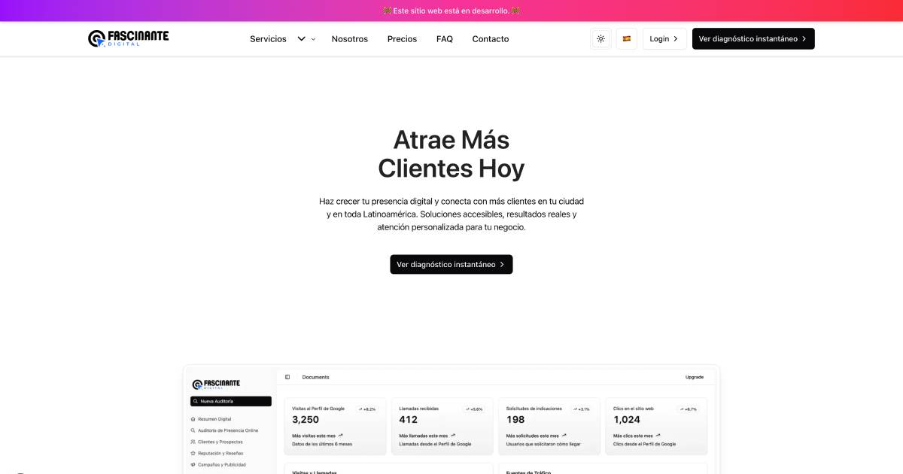

# Fascinante Digital

## Nota importante sobre internacionalización

**Los archivos de traducción (`messages/es.json`, `messages/en.json`, etc.) deben estar únicamente en la raíz del proyecto.**

- No crees ni uses archivos de traducción en `src/messages` ni en ninguna otra carpeta.
- Toda la importación y carga de mensajes debe apuntar a la raíz (`messages/es.json`, `messages/en.json`).
- Esto evita errores, duplicados y problemas de sincronización en la internacionalización.

---

# Relative Next.js Template

Relative Next.js Template is a premium template built by https://www.shadcnblocks.com

- [Demo](https://relative-nextjs-template.vercel.app/)
- [Documentation](https://docs.shadcnblocks.com/templates/getting-started)

## Captura de Pantalla



## Comenzando

pnpm install

```bash
npm run dev
```

Open [http://localhost:3000](http://localhost:3000) with your browser to see the result.

## Tech Stack

- Next.js 15 / App Router
- Tailwind CSS 4
- "shadcn/ui"

## Deploy on Vercel

The easiest way to deploy your Next.js app is to use the [Vercel Platform](https://vercel.com)
